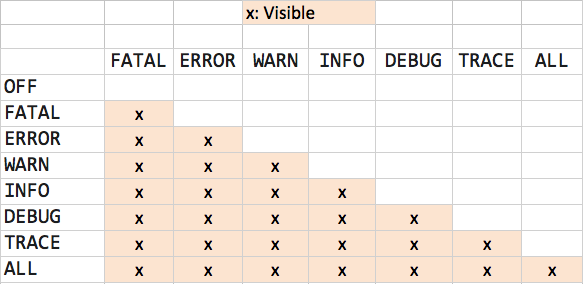

# TechTalk: Logging Policy

 
## Introduction
 

Broadly speaking, logging policy is often a controversial issue in software engineering.

The amount of log generated in services receiving thousand of request in a short period of time may have an impact in terms of:

*   **space to save the logs**: the amount of space is finite and expensive
    
*   **reduced capability to exploit these logs using tools like kibana** 
    
*   **performance**: services and its underlying infrastructure may have an impact on performance
    

Based on this,  the following is a guideline to address and mitigage these issues

## Log level and strategies
 

The following are the typically available logs

*   **INFO**: to be used when everything goes smoothly, nothing unexpected happened
    

*   **WARN**: to be used when something **unexpected** happened, but this doesn’t prevent to continue the execution, in other words, when there is a scenario that brokes the implicit or explicit _contract_ but there is a “way out” of the problem, perhaps by assuming default values or behaviour.
    

*   **ERROR:** something **unexpected** happened that prevented the correct execution
    

*   **TRACE / DEBUG**: to be used to describe relevant data or execution flow that may help the developer to find out a problem or explain a behaviour. The differences between TRACE and DEBUG are subtle.

*   **FATAL**: the application can not be executed as it should, it is used typically by low level components or the underlying frameworks, i.e, it should not be used when developing business logic. 
    

#### Log amount

Code may fall into two categories:

##### Infrequently executed code

*   this code is typically executed at startup time or in periodic tasks
    

*   Rule of thumb:
    
    *   use **INFO** / **WARN** / **ERROR**
        
    *   only detailed data or subtle details in **DEBUG / TRACE.**
        

##### Frequently executed code

*   this code is typically executed in services processing many requests/events per second.
    
*   Rule of thumb:
    
    *   use **TRACE/DEBUG** as many times as necessary
        
    *   use **WARN** as many times as necessary
        
    *   A good strategy is after finishing the request execution there will only be **ONE** log line that summarizes the request. It should include data such as relevant parameters/headers, response time and status code. The log level will be one of the following:
        
        *   **INFO**: if everything went well, the contract is matched 100%
            
        *   **ERROR**: if an error that prevented the execution happened, perhaps with an error code or something like this in the log as well as the full stack trace or the exception message
            
        *   **WARN**: There is a _controlled_ situation that prevents to process the **expected** flow. Please keep in mind that by definion, if the situation is _controlled_, then it can not log as an **ERROR.** Examples**:**
            
            *   if the incoming request parameters “break” the _contract_ of the endpoint or process, for example, a mandatory field is not sent, an incorrect authentication token…
                
            *   in order to process the incoming request, the service requires another service to be up and running, but that is not the case and this is managed in a custom manner.
                

 
  As explained, there will be only one log line that summarizes the request execution, which could be <strong>INFO</strong>, <strong>ERROR</strong> or <strong>WARN</strong>, this log line will be written by the top class of the execution hierarchy, which is normally a <strong>Controller</strong> or <strong>Handler</strong>

#### Production log level

Typically production environment will have INFO level, which will include these levels as well: FATAL, ERROR and WARN as well (see the hierarchy below).



## Good Practices


### Following logs of the same request / task
 

In non reactive environments it is easy to follow all the logs of a particular request because they will log the executing **threadId**, which is the same in all lifecycle of the request.

In reactive environments specially (Ratpack or WebFluxReactor), the **threadId** can not be used to follow the lines of logs because the executing thread may change and that is a problem, the solution is to used a **Identifier of the request**

Althoug WebFlux creates a particular logId for every request, it is much better to use [Sleuth](https://spring.io/projects/spring-cloud-sleuth/) , which manages automatically the logging in to the reactive chain and much much more interesting features.


### Markers
 

Markers are **standard** way to _mark_ a group of one or more lines of logs by a certain criterion, for example logic blocks of code or functionality.

It allows to analyse and understand easily the log _chaos._

Markers are defined in _slf4j_, which means almost all java implementations support them

 

The interesting thing is that a Marker is an object

```java
public class MyClass {
 public static Marker MARKER = MarkerFactory.getMarker("MY_MARKER");
```

It can be used later as follows
```java
   LOG.debug(MARKER, "Beginning ....");
```
 


### Avoid printing useless stack trace lines
 

Sometimes we need to show more than only the error message, for example when an unexpected error has occurred. In these cases, a huge amount of stack trace lines from different external libraries and frameworks are usually displayed, which do not have any relevant information and may even lead to some confusion when trying to trace the source of the problem.

There is a simple solution for this problem: add regular expressions in the log pattern configuration to exclude them from the log when stacktrace lines are displayed.

Example:
```java
logging.pattern.console=%d{yyyy-MM-dd'T'HH:mm:ss.SSSZ} [%thread] %-5level %logger{36} - %marker - %msg%n%ex{\
        full,\
        io.netty,\
        reactor.netty,\
        reactor.core}
```


Check more information in about this feature in the [logback documentation](https://logback.qos.ch/manual/layouts.html#ex).

### AntiPattern: Don’t log and throw Exception
 

Avoid this antipattern

<table data-table-width="760" data-layout="default" data-local-id="fd258021-5ca7-4d5c-8704-2a2e10afef2c" class="confluenceTable"><colgroup><col style="width: 680.0px;"></colgroup><tbody><tr><td data-highlight-colour="initial" class="confluenceTd"><div class="code panel pdl" style="border-width: 1px;"><div class="codeContent panelContent pdl"><pre class="syntaxhighlighter-pre" data-syntaxhighlighter-params="brush: groovy; gutter: false; theme: Default" data-theme="Default">try {
&nbsp;
&nbsp;&nbsp;// do some logic
&nbsp;
} catch (JsonProcessingException e) {
&nbsp;&nbsp;log.error("Problem converting ...",e);
&nbsp;&nbsp;throw e;
}</pre></div></div></td></tr></tbody></table>

Ideally replace it by

<table data-table-width="760" data-layout="default" data-local-id="b284e275-bde7-4416-9645-f133771ce69e" class="confluenceTable"><colgroup><col style="width: 680.0px;"></colgroup><tbody><tr><td data-highlight-colour="initial" class="confluenceTd"><div class="code panel pdl" style="border-width: 1px;"><div class="codeContent panelContent pdl"><pre class="syntaxhighlighter-pre" data-syntaxhighlighter-params="brush: groovy; gutter: false; theme: Default" data-theme="Default">try {
&nbsp;
&nbsp;&nbsp;// do some logic
&nbsp;
} catch (JsonProcessingException e) {
&nbsp;&nbsp;throw new MyBusinessException("Problem converting ...", e);
}</pre></div></div></td></tr></tbody></table>

where `MyBusinessException` is a custom exception which gives much more semantic meaning.

This exception should be catched properly at the corresponding level and will trace there according to the aforementioned rules

### Only log what really matters
 

There are not universal rules

As a rule of thumb → Log or Propagate ONLY thing that provides information !!!!

Questions to ask ouservelves:

Does logging this message provide useful information ?
Does logging this exception provide useful information ?


APPENDIX: Exception chaining in Java
------------------------------------

Java keeps the whole exception chain when logging

```java
package test;

/* this is a just a quick sample to prove how Java chains exceptions 
without any external library
in a real project don't log with System.out.println or print stack track
using e.printStackTrace()
*/

public class Test {

    public static void main (String args[]) {
        try {
            method1();            
        } catch (Exception e) {
            e.printStackTrace();
        }        
    }

    public static void method1() {
        try {
            System.out.println("init method 1");
            method2();
            System.out.println("end method 1");
        } catch (Exception e) {
            throw new Sample1Exception("Exception method 1", e);
        }
    }

    public static void method2() {
        System.out.println("init method 2");
        throw new Sample2Exception("Exception method 2");
    }
}
```

Result:

```java
init method 1
init method 2
test.Sample1Exception: Exception method 1
	at test.Test.method1(Test.java:19)
	at test.Test.main(Test.java:7)
Caused by: test.Sample2Exception: Exception method 2
	at test.Test.method2(Test.java:25)
	at test.Test.method1(Test.java:16)
	... 1 more
```

But cleverly enough, Java avoids to repeat stack trace lines

(1.. more) is actually:

`at test.Test.main(Test.java:7)`
