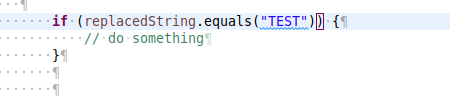

# **SonarLint**
- [Introduction](#sonarlint-introduction) 
  - [Rules](#sonarlint-rules)
- [Installation and Configuration](#sonarlint-installationandconfiguration) 
  - [Installation in Eclipse](#sonarlint-installationineclipse)
  - [Configuration](#sonarlint-configuration) 
    - 
  - 
  - [Exporting / Importing SonarLint Rules](#sonarlint-exporting/importingsonarlintrules)
- [Using SonarLint](#sonarlint-usingsonarlint)
- [Some Interesting and useful Rules](#sonarlint-someinterestingandusefulrules)
- [Disable SonarLint Rules](#sonarlint-disablesonarlintrules)
- [Proposed Rules Configuration](#sonarlint-proposedrulesconfiguration)
# **Introduction**

[SonarLint ](https://www.sonarlint.org/)is an open source IDE plugin (Eclipse, Intellij, VisualStudio)  that helps you detect and fix quality issues **as you write (real time)** in order to:

- Avoid Bugs
- Write more performant code
- Write cleaner code

SonarLint is a *member* of the well-known [SonarQube](https://www.sonarqube.org/) ecosystem. But it can work as a standalone product.

## **Rules**
[SonarLint](https://www.sonarlint.org/) defines a set of Rules for many languages. For Java [it covers more than 640 rules](https://rules.sonarsource.com/java)

Each rule is categorized into the following:

- **Bug**
- **Code Smell**
- **Vulnerability**
- **Security HotSpot**

and a Severity Level  (Impact  / Likelihood):

- **Minor**
- **Major**
- **Critical**
- **Blocker**

Please find more information about rules [here](https://docs.sonarqube.org/latest/user-guide/rules/)

# **Installation and Configuration**

## **Installation in Eclipse**

1. As first step, update your lombok.jar (located in your eclipse directory) to the[latest version ](https://projectlombok.org/download)
1. Using eclipse MarketPlace, install "SonarLint" plugin
1. Restart your eclipse
1. Check it is available  in Eclipse Preferences → SonarLint

## **Configuration**

1. Go to Preferences → SonarLint → Rules Configuration

You can enable or disable rules for a particular language. Some of them can be configured by setting parameters. Once enable or disabled click on Apply
#### 

It is possible to configure how Eclipse will point a rule violation in the IDE, to do that configure Text Editor Annotations  in Eclipse
## 
## **Exporting  / Importing SonarLint Rules**

Although there is not straight option to Export/Import rules, the following trick works:

Rules configutations are actually stored in a settings files on your eclipse directory:

/eclipse/configuration/.settings/org.sonarlint.eclipse.ui.prefs

So you can read/write file  **org.sonarlint.eclipse.ui.prefs** in order to export/import rules.
# **Using SonarLint**

It is possible to analyze a whole  project, to do that  click on Menu "SonarLint" → Analize

After some time of analysis, all violations will appear in the "SonarLint Repor" tab

However, as pointed before,  the most interesting option is the ability to analyze code **as we write,** it underlines  the problematic code and 

when the pointer is over the code, it shows a little popup with the

- Name of the rule
- Fixes available, which may include among others:  
  - ***Open description of rule***: a detailed explanation about the rule
  - ***Deactivate Rule***

# **Some Interesting and useful Rules**

Some interesting examples to avoid bugs:

|**Rule**|**Category**|**Security Level**|**Comment**|
| :-: | :-: | :-: | :-: |
|[Null pointers should not be dereferenced](https://rules.sonarsource.com/java/RSPEC-2259) |Bug|Major|very useful to avoid NPE|
|[Week Year ("YYYY") should not be used for date formatting](https://rules.sonarsource.com/java/type/Bug/RSPEC-3986)|Bug|Major|subtle bug→ only happens in one week of the year|
|[Strings and Boxed types should be compared using "equals()"](https://rules.sonarsource.com/java/RSPEC-4973)|Bug|Major|subtle bug → only detectable sometimes|
|[Inappropriate "Collection" calls should not be made](https://rules.sonarsource.com/java/RSPEC-2175)|Bug|Major|subtle bug → only detectable in runtime|
|[Printf-style format strings should not lead to unexpected behavior at runtime](https://rules.sonarsource.com/java/RSPEC-2275)|Bug|Blocker|subtle bug → only detectable in runtime|
|[Empty arrays and collections should be returned instead of null](https://rules.sonarsource.com/java/RSPEC-1168)|Code Smell|Major|good practice → avoid potential bug NPE|
|[Strings literals should be placed on the left side when checking for equality](https://rules.sonarsource.com/java/tag/bad-practice/RSPEC-1132)|Code Smell|Major|good practice → avoid potential bug NPE|

Some interesting examples to optimize performance :

|**Rule**|**Category**|**Security Level**|**Comment**|
| :-: | :-: | :-: | :-: |
|["String#replace" should be preferred to "String#replaceAll"](https://rules.sonarsource.com/java/RSPEC-5361)|Code Smell|Critical|performance tip|
|[Synchronized classes Vector, Hashtable, Stack and StringBuffer should not be used](https://rules.sonarsource.com/java/RSPEC-1149)|Code Smell|Major|performance tip|
|[Maps with keys that are enum values should be replaced with EnumMap](https://rules.sonarsource.com/java/type/Code%20Smell/RSPEC-1640)|Code Smell|Minor|performance tip|

Some examples of rules for good **CLEAN CODE**

**Please consider these rules just a guideline. There are cases in which is good idea to break the rule indeed.**

|**Rule**|**Category**|**Security Level**|**Comment**|
| :-: | :-: | :-: | :-: |
|[Methods should not have too many lines](https://rules.sonarsource.com/java/RSPEC-138)|Code Smell|Major|
50 

*This is a controversial point.* 

*Clean Code Guru Robert C. Martin (Uncle Bob) says:*

*"My rule is “extract till you drop”. A function is too big if I can meaningfully extract another function from it. This often leads to functions that are 5 lines or less."*

NOTE: Small methods are likely to be inlined by the JIT
|
|[Methods should not have too many parameters](https://rules.sonarsource.com/java/RSPEC-107)|Code Smell|Major|
5 

*This is a controversial point*

*"Uncle Bob says three is the maximum arguments acceptable !!"*
|
|[Methods should not have too many return statements](https://rules.sonarsource.com/java/RSPEC-1142)|Code Smell|Major|
3 

*This is a controversial point. Uncle Bob says:*

` `*"if you keep your functions small, then the occasional multiple return, break, or continue statement does no harm and can sometimes even be more expressive than the single-entry, single-exit rule."*
|
|[Classes should not be coupled to too many other classes (Single Responsibility Principle)](https://rules.sonarsource.com/java/RSPEC-1200)|Code Smell|Major|30 → goal: class should be only one responsability. → split class if this rule is violated|
|[Classes should not have too many fields](https://rules.sonarsource.com/java/RSPEC-1820)|Code Smell|Major|20 (included non public) → split class if this rule is violated|
|[Classes should not have too many methods](https://rules.sonarsource.com/java/RSPEC-1448)|Code Smell|Major|25 (included non public)→ split class if this rule is violated|
|[Files should not have too many lines of code](https://rules.sonarsource.com/java/RSPEC-104)|Code Smell|Major|600 → split class if this rule is violated|
|[Control flow statements "if", "for", "while", "switch" and "try" should not be nested too deeply](https://rules.sonarsource.com/java/RSPEC-134)|Code Smell|Critical|3 → refactor logic  if this rule is violated|
|[Expressions should not be too complex](https://rules.sonarsource.com/java/RSPEC-1067)|Code Smell|Critical|3→ refactor logic  if this rule is violated|
|[Cognitive Complexity of methods should not be too high](https://rules.sonarsource.com/java/RSPEC-3776)|Code Smell|Critical|
15 → refactor logic  if this rule is violated

Cyclomatic Complexity is not enough !!

<https://www.sonarsource.com/docs/CognitiveComplexity.pdf>
|
|
- ["switch" statements should not have too many "case" clauses](https://rules.sonarsource.com/java/type/Code%20Smell/RSPEC-1479)

- ["switch" statements should have at least 3 "case" clauses](https://rules.sonarsource.com/java/type/Code%20Smell/RSPEC-1301)
|Code Smell|Major|30 → refactor logic  if this rule is violated|
|
- [Lambdas should not have too many lines](https://rules.sonarsource.com/java/RSPEC-5612)

- [Anonymous classes should not have too many lines](https://rules.sonarsource.com/java/RSPEC-1188)

- [Inner classes should not have too many lines of code](https://rules.sonarsource.com/java/RSPEC-2972)
|||
15→ refactor logic  if this rule is violated

20→ refactor logic  if this rule is violated

20→ refactor logic  if this rule is violated
|
|[Public methods should not contain selector arguments](https://rules.sonarsource.com/java/RSPEC-2301)|Code Smell|Major|` `refactor logic if this rule is violated|
|[Try-catch blocks should not be nested](https://rules.sonarsource.com/java/type/Code%20Smell/RSPEC-1141)|Code Smell|Major|` `refactor logic if this rule is violated|

Some examples of rules for good style (similar to *Checkstyle Plugin (eclipse-cs)* )

|**Rule**|**Category**|**Security Level**|**Comment**|
| :-: | :-: | :-: | :-: |
|[Tabulation characters should not be used](https://rules.sonarsource.com/java/RSPEC-105)|Code Smell|Minor||
|[Statements should be on separate lines](https://rules.sonarsource.com/java/RSPEC-122)|Code Smell|Major||
|[Lines should not be too long](https://rules.sonarsource.com/java/RSPEC-103)|Code Smell|Major|150|
|[Close curly brace and the next "else", "catch" and "finally" keywords should be located on the same line](https://rules.sonarsource.com/java/RSPEC-1107)|Code Smell|Minor||
|[Statements should be on separate lines](https://rules.sonarsource.com/java/RSPEC-122)|Code Small|Major||
# **Disable SonarLint Rules**

Let's take an example:

Let's suposse I don't agree with a particular rule in one place, for example:

which violates  [Local variables should not be declared and then immediately returned or thrown](https://rules.sonarsource.com/java/type/Code%20Smell/RSPEC-1488)

But I really want to have this local variable because I want to inspect the variable when debugging 

In order to disable it just in one place, just add a comment at then end of the line (//NOSONAR)

# **Proposed Rules Configuration**

The rules explained before are defined in the following file:

org.sonarlint.eclipse.ui.prefs

