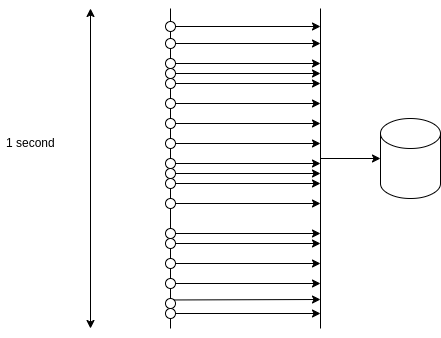
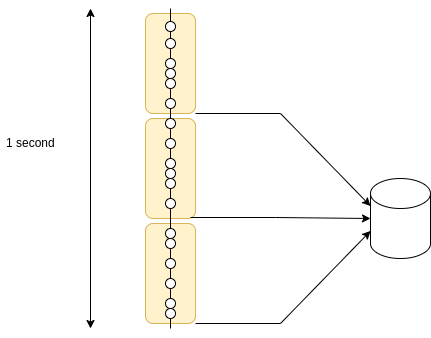

# TechTalk: Delayed-Batch-Executor
 

## Introduction


Delayed-Batch-Executor is a public library that I wrote to optimize the usage of database in a multithread java application

[https://github.com/victormpcmun/delayed-batch-executor](https://github.com/victormpcmun/delayed-batch-executor)

[https://web.archive.org/web/20200815000143/https://dzone.com/articles/delayedbatchexecutor-how-to-optimize-database-usag](https://web.archive.org/web/20200815000143/https://dzone.com/articles/delayedbatchexecutor-how-to-optimize-database-usag)

## Database queries

The following is a paradigmatic example:

Let’s assume there is a oracle database with a table called `DEVICE`. This table may have millions of rows

Using SQL DEVELOPER, It is easy to check that the time to perform a query for a particular id  is around 200 ms.

```sql
SELECT * FROM DEVICE WHERE ID= 432453453-- 0.2 seconds

SELECT * FROM DEVICE WHERE ID= 162458453 -- 0.2 seconds

SELECT * FROM DEVICE WHERE ID= 786523343 -- 0.2 seconds

SELECT * FROM DEVICE WHERE ID= 522987123 -- 0.2 seconds
```

Now, let’s find out the time to retrieve four rows _at the same time_ using IN statement

```sql
SELECT * FROM CORE_INSTALLED_DEVICE WHERE ID in
(
874328747,
667983432,
998110953,
673832848
)
```

Surprisingly it takes around 0.2 seconds, same amount of time !!!! . The reason behind is database do optimize very well these types of queries

## DelayedBatchExecutor (DBE)


Let’s suppose a service that offers an endpoint that requires to access database by a parameter and this endpoint has many hits per second.

DelayedBatchExecutor is a component that allows to “gather” some of the individuals parameters of the query in **time window**s as a list of parameters to perform queries using IN approach, so the number of queries are reduced. This has two important advantages:

1.  The usage of network resources is reduced dramatically: The number of round-trips to the database is 1 instead of n.
    
2.  The usage of database connections from the connection pool is reduced: there are more available connections overall, which means less waiting time for a connection on peak times.
    

**In short, it is much more efficient executing 1 query of n parameters than n queries of one parameter, which means that the system as a whole requires less resources.**

### Example

Let’s suppose an endpoint receives 18 requests in one second,

```java
/device/{id}
```

1.  each request will perform a different query to table `DEVICE` using id parameter
    



*   In total there are 18 queries, some of them will overlap in time
    
*   the total time for each request will be the time required to perform the query + preparing the response from the data retrieved by the query
    

Now, using DBE, the queries fall in one of the time windows:



request parameters are “gathered” in one list:

*   only three queries, each one with several parameters (using IN clause)
    
*   The query is launched just after finishing the time window
    
*   the total time for each request will be the sum of:
    
    *   the waiting time to finish the window
        
    *   time required to perform the query
        
    *   preparing the response from the data retrieved by the query
        

Each time window is a DBE execution.

Strictly speaking, a DBE is defined by three parameters:

*   **TimeWindow**: defined as java.time.Duration
    
*   **max size**: it is the max number of items to be collected in the list
    
*   **batchCallback**: it receives the parameters list to perform a single query and must return a list with the corresponding results.
    

for example

Le’ts define a DBE that receives a parameter Integer and returns a String

```java
DelayedBatchExecutor2<String,Integer> dbe = 
      DelayedBatchExecutor2.create(Duration.ofMillis(50), 100, this::myBatchCallBack);

...

List<String> myBatchCallBack(List<Integer> listOfIntegers) {
  List<String>  resultList = ...// execute query:SELECT * FROM TABKE WHERE ID IN (listOfIntegers.get(0), ..., listOfIntegers.get(n));
                              // use your favourite API: JDBC, JPA, Hibernate,...
	...
	return resultList;
}
```

to use it in the code executed by each thread attending:

```java
// this code is executed in one of the multiple threads
int param=...;
String result = dbe.execute(param);
}
```

### DBE Execution policies

There are three policies to use a DelayedBatchExecutor from the code being executed from the threads

#### Blocking Policy

*   Blocking
    
*   Non-blocking (java.util.concurrent.Future)
    
*   Non-blocking (Reactive using Reactor framework)
    

see: [https://github.com/victor-porcar/delayed-batch-executor#execution-policies](https://github.com/victormpcmun/delayed-batch-executor#execution-policies)
