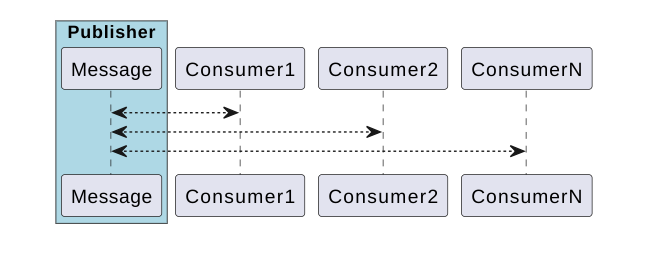

# TechTalk: Reactive programming in WebFlux

## Introduction to Reactive Paradigm
 



  

Example: Let's suppose a MQTT topic (queue) with many clients "listening" to that queue, so as soon as there is a new element in the topic, all clients will receive that element and will process it

*   MQTT queue is a  **Publisher (Produces data)**
*   Every client is a  **Subscriber (Consumes data)**
*   the Connection between the Subscriber and Publisher is called **Subscription (arrows)**

  

This scenario is **reactive** because the subscriber will **_react_** to a new data published by the Publisher **Asynchronously**

*   It is message-driven mechanism
*   Low coupling between Publishe and Subscriber

## Reactive Programming in Java 
 
While **Asynchronous** **processing** is quite old in computing, in Java it can be achieved from the very first day by Managing Threads in an _ad-hoc_ solution (from Java 1) or using java.concurrent.util API (from Java 1.5)

**Reactive**  Paradigm was introduced as a trend a few years ago.

This paradigm introduced explicitely concepts such as **Publisher**, **Subscriptor**, **Subscription**...

There was an important effort to create a **common** API specification for the Java World, which is called [Reactive Streams](https://github.com/reactive-streams/reactive-streams-jvm).

Please note [Reactive Streams](https://github.com/reactive-streams/reactive-streams-jvm) is an specification, not an implementation !!!.

There are several implementations:

*   [Reactor library](https://projectreactor.io/) : the chosen implementation for Spring Boot
*   [RxJava](https://github.com/ReactiveX/RxJava): created initially by Netflix
*   [RatPack](https://github.com/ratpack/)
*   [Vert.x](https://vertx.io/)
*   [Java 9](https://www.reactive-streams.org/) 

### Spring Boot WebFlux Reactor
 

As pointed, Spring Boot uses **Reactor** as _Reactive streams_ implementation to provide Reactive Programming.

In order to get the most reactive behaviour, all the components responsible for I/O communications should be **Asynchronous (non-blocking)**

Fortunately there are some of them in the Java Ecosystem:

  

*   **Web Server**: 
    *   Netty
    *   Undertow
    *   Servlet 3.1+

  

*   **Reactive repositories:**
    *   Mongo
    *   Cassandra
    *   Redis (Lettuce)
    *   CouchBase
    *   R2DBC
    *   NOTE: There is not an official implementation for JDBC / Oracle database. See later

  

<table class="wrapped confluenceTable"><colgroup><col></colgroup><tbody><tr><th class="confluenceTh"><strong>WebFlux Reactor =&nbsp; Spring Boot + Reactor library +&nbsp; Async I/O communication modules</strong></th></tr></tbody></table>

  
 

## Why and When Reactive Programming is good idea?
 

In the context of a Web Service, let's compare a traditional approach (_Thread-per-request_) vs _reactive_ approach

### _Thread-per-Request_ processing 

  

Java applications have been built over the years following the _Thread-per-Request_  paradigm, in which the **same** thread is used for all operations required for a request, these operations may include:

*   CPU processing operations: the thread in which is executed the request is not blocked, it is "working" all the time 
*   I/O operation (database queries, request to another service): the thread is blocked until the I/O has finished

  

**Consequence**: If the load is high and there are many I/O operations → the number of concurrent threads is high, most of them will be blocked

  

Let's see some interesting related questions:

*   **Does having a lot of  concurrent threads use a lot of memory?** Yes, because the execution context of a single thread requires memory, so having a lot of threads means a lot of memory (potentially)
*   **Is having a lot of concurrent threads  bad for the performance?** Not _per se (_a blocked thread does not consume CPU cycles). However if there are many thread it forces the Operating System to swaps contexts between threads, which is an expensive operation.

  

### _Reactive Programming_

  

In reactive programming, threads are not blocked or waiting for a I/O  to complete. Instead they are notified when the I/O  is complete / the data changes.  which means:

  

<table class="wrapped confluenceTable"><colgroup><col style="width: 528.0px;"></colgroup><tbody><tr><th class="confluenceTh"><span data-colorid="dv2v52gx30"><strong>less threads are required → less resources are required to process the same&nbsp;</strong></span></th></tr></tbody></table>

The problem with Reactive Programming is the code usually is more complex → difficult to maintain and to extend


<table class="wrapped confluenceTable"><colgroup><col></colgroup><tbody><tr><th class="confluenceTh"><strong>is good idea to use WebFlux Reactor ???&nbsp;&nbsp;</strong></p><p>My opinion:&nbsp; If there is a lot of potentially blocking I/O operations then it would be good idea, otherwise stick in the<em> traditional way (not reactive)</strong></th></tr></tbody></table>

 

## Digging deeper in WebFlux Reactor
 

  

In order to understand how to build a WebFlux Reactor application, it is necessary to master the following concepts:

  

*   Types [Mono](https://projectreactor.io/docs/core/release/api/reactor/core/publisher/Mono.html) and [Flux](https://projectreactor.io/docs/core/release/api/reactor/core/publisher/Flux.html) of the Reactor library → These types provides most of the Reactive functionality.
*   Exceptions / Timeouts while executing Mono or Flux
*   Blocking scenario
*   Web Applications: Reactive RestController / WebClient 
*   Reactive Repositories: to avoid blocking operations on these repositories

Besides it is interesting to understand the [Scheduler](https://projectreactor.io/docs/core/release/api/reactor/core/scheduler/Scheduler.html) interface, which is a part of the Reactor library and provides  thread pool management.

  

We'll see all these concepts in detail below.

Mono
----

 It represents a Publisher that can emit _0..1_ element.

  

We can think of a Mono<T> as object that has:

*   [Consumer](https://docs.oracle.com/javase/8/docs/api/java/util/function/Consumer.html) object which is actually a  method of executable "code" that receives a a parameter a value of type T → this "code" can be provided as lambda function or method reference
*   one method call _subscribe_ 

  

As soon as the _subscribe_ method is invoke, the Mono will generate a value of type T and this value will be passed to the executable "code", in asynchronous way

In other words, a Mono<T> as a component **Publisher** that WILL _publish_ a value of type T to a provided handler (**Subscriptor**) when its method _subscribe_ is invoked. 

  

What value will it publish? well it depends on the Mono creator, for example if the Mono is created by the Reactive WebClient, the value will be the response of the performed request.

```java
1        Mono<Employee> monoEmployee= getEmployeeMonoByNameUsingReactiveWebClient("http://localhost:8080/demo?name=" + employeeName);
2        
3        // until the subscribe method is invoked, nothing happen
4        
5        monoEmployee.subscribe(employee -> {
6          
7            System.out.println("Employee:" + employee.getName() + " has id=" + employee.getId());
8 
9         });
10        
11       // do other operations
12        
13       System.out.println("execution continues   ");
```
 

  

Please note:

*   if _subscribe_ method is not invoked nothing happens
*   the handler is normally executed in a different thread (see detail later), in the following example it means that line 13 could be executed before line 7
*   The generation of value of type T  implies that something has to do, in the case of Reactive Webclient it means to perform the actual request to the server...

  

  

### Operators

[The official Documentation explains very well all operat](https://projectreactor.io/docs/core/release/api/reactor/core/publisher/Mono.html)[ors](https://projectreactor.io/docs/core/release/api/reactor/core/publisher/Mono.html)

#### Map

transform the Mono by building another Mono

  
```java
     Mono<Employee> monoEmployee= getEmployeeMonoByNameUsingReactiveWebClient("http://localhost:8080/demo?name=" + employeeName);
    
    // do other operations
    
    Mono<Integer> monoSalary = monoEmployee.map(employee -> {
        Integer salary = employee.getSeniorityInYears() * 2000 + 50000;
        return salary;
    });
    
    
    monoSalary.subscribe(salary -> {
        // async block
        
        System.out.println("Employee:" + employeeName + " salary is:" + salary);
    });

```  

#### FlatMap

transform the Mono by chaining another existing Mono

  
```java
1        Mono<Employee> monoEmployee= getEmployeeMonoByNameUsingReactiveWebClient("http://localhost:8080/demo?name=" + employeeName);
2        
3        // do other operations
4        
5        Mono<Integer> monoSalary = monoEmployee.flatMap(employee -> {
6            Integer employeeId = employee.getId();
7            Mono<Integer> salaryMonoFromDatabase = getSalaryFromUserIDatabaseReactive(employeeId);
8            return salaryMonoFromDatabase;
9        });
10        
11        
12        monoSalary.subscribe(salary -> {
13            // async block
14            
15            System.out.println("Employee:" + employeeName + " salary is:" + salary);
16        });
17        
18        // do other operations

```
  

#### Zip

This operator combines two or more Mono→ subscribes to all Monos  and builds a new one as a result of the combination
```java
     Mono<Employee> monoEmployee= getEmployeeMonoByNameUsingReactiveWebClient("http://localhost:8080/demo?name=" + employeeName);
     
     // do other operations
     
     Mono<Integer> monoSalary = monoEmployee.flatMap(employee -> {
         Integer employeeId = employee.getId();
         Mono<Integer> salaryMonoFromDatabase = getSalaryFromUserIDatabaseReactive(employeeId);
         Mono<Integer> bonusByUserId = getBonusByEmployeeId(employeeId);
         

         Mono<Integer> totalSalary =  Mono.zip(salaryMonoFromDatabase, bonusByUserId).map(data -> {
             Integer salary = data.getT1();
             Integer bonus = data.getT2();
             return salary + bonus;
         });
          
         
         return totalSalary;

     });
     
     
     monoSalary.subscribe(salary -> {
         // async block
         
         System.out.println("Employee:" + employeeName + " salary is:" + salary);
     });
     
      
     // do other operations
```
  

 
  

Flux
----

 It represents a stream that can emit _0..n_ elements. 

The idea is the similar to Mono but with n elements

 ```java
   Flux<Integer> salariesFlux = getSalariesOfAllEmployeesFlux();
   
   
   salariesFlux.subscribe(element -> {
       System.out.println(element);
   });
```
  

[The official Documentation explains very well all operat](https://projectreactor.io/docs/core/release/api/reactor/core/publisher/Mono.html)[ors](https://projectreactor.io/docs/core/release/api/reactor/core/publisher/Mono.html)

  

Exceptions  / timeout
---------------------

  

There are some operators to deal with exceptions happening inside of a callback, most common used:

*   **_doOnError_**
*   **_onErrorResume_**

  

The operator _**timeout**_ will propagate a  _[java.util.concurrent.TimeoutException](https://docs.oracle.com/javase/8/docs/api/java/util/concurrent/TimeoutException.html)_

  
 ```java
    String valueString = "text";
    long millSleep=1000;
    
    Mono<Integer> valueIntMono = Mono.just(valueString).map(value -> {
        sleepMill(millSleep);
        Integer valueAsInt = Integer.valueOf(value);
        return valueAsInt;
        
    });
    
    valueIntMono
        .timeout(Duration.ofMillis(500))
        .doOnError(throwable -> throwable.printStackTrace())
        .subscribe(valueInt-> System.out.println(valueInt));
 ```
 
  

  

Blocking scenario
-----------------

block(): Subscribe to this [`Mono`](https://projectreactor.io/docs/core/release/api/reactor/core/publisher/Mono.html "class in reactor.core.publisher") and **block indefinitely** until a next signal is received.
 ```java
    String valueString = "12";
    long millSleep=100;
    
    Mono<Integer> valueIntMono = Mono.just(valueString).map(value -> {
        sleepMill(millSleep);
        Integer valueAsInt = Integer.valueOf(value);
        return valueAsInt;
        
    });
    
    Integer valueInt = valueIntMono.block();
 ```

Schedulers
----------

  

If the previous are executed, it is easy to check that the thread being used to execute the asynchronous code is actually the same thread that is running the main flow, which means that is not working really in a synchronous way, the reason is we have to provide a Thread Pool to execute async tasks

This is done by [Schedulers](https://projectreactor.io/docs/core/release/api/reactor/core/scheduler/Schedulers.html), 

  

In order to define a Scheduler, there are some predefined configurations

*   [`parallel()`](https://projectreactor.io/docs/core/release/api/reactor/core/scheduler/Schedulers.html#parallel--): Optimized for fast [`Runnable`](https://docs.oracle.com/javase/8/docs/api/java/lang/Runnable.html?is-external=true "class or interface in java.lang") non-blocking executions
*   [`single()`](https://projectreactor.io/docs/core/release/api/reactor/core/scheduler/Schedulers.html#single--): Optimized for low-latency [`Runnable`](https://docs.oracle.com/javase/8/docs/api/java/lang/Runnable.html?is-external=true "class or interface in java.lang") one-off executions
*   [`elastic()`](https://projectreactor.io/docs/core/release/api/reactor/core/scheduler/Schedulers.html#elastic--): Optimized for longer executions, an alternative for blocking tasks where the number of active tasks (and threads) can grow indefinitely
*   [`boundedElastic()`](https://projectreactor.io/docs/core/release/api/reactor/core/scheduler/Schedulers.html#boundedElastic--): Optimized for longer executions, an alternative for blocking tasks where the number of active tasks (and threads) is capped
*   [`immediate()`](https://projectreactor.io/docs/core/release/api/reactor/core/scheduler/Schedulers.html#immediate--): to immediately run submitted [`Runnable`](https://docs.oracle.com/javase/8/docs/api/java/lang/Runnable.html?is-external=true "class or interface in java.lang") instead of scheduling them (somewhat of a no-op or "null object" [`Scheduler`](https://projectreactor.io/docs/core/release/api/reactor/core/scheduler/Scheduler.html "interface in reactor.core.scheduler"))
*   [`fromExecutorService(ExecutorService)`](https://projectreactor.io/docs/core/release/api/reactor/core/scheduler/Schedulers.html#fromExecutorService-java.util.concurrent.ExecutorService-) to create new instances around [`Executors`](https://docs.oracle.com/javase/8/docs/api/java/util/concurrent/Executors.html?is-external=true "class or interface in java.util.concurrent")

  

or configurable:

  
Once the Scheduler is defined, it is possible to set it to be used by a Mono or Flux using the method _**publishOn**_  or **_SubscribeOn_**

  

*   **_publishOn_**:  It affects subsequent operators after `publishOn` - from that point the code will be executed by a thread picked from `publishOn`'s scheduler.
*   **_subscribeOn_**: similar to publishOn, but it affects  all the chain (before and after) `subscribeOn`

 ```java
1        Scheduler schedulerA = Schedulers.newParallel("publisherThreads",2);
2
3        
4        Flux<Integer> numberFlux = Flux.range(1,2);
5        //Flux<Integer> numberFlux = Flux.range(1,2).publishOn(schedulerA);
6        
7        numberFlux.subscribe(number -> {
8            System.out.println(String.format("Flux element - (%s), Thread: %s", number, Thread.currentThread().getName()));
9        });
10
11       System.out.println("Execution continues");
 ```

as it is the block
 ```java
Flux element - (1), Thread: main
Flux element - (2), Thread: main
Execution continues
 ```
   

commenting line 4 and uncommenting line 5

 ```java
ExecutionContinues
Flux element - (1), Thread: publisherThreads-1
Flux element - (2), Thread: publisherThreads-1
 ```

 

**Reactive Web Server**
-----------------------

  

Let's see how it works in a nutshell:

1.  the incoming HTTP request is received by the reactive engine implementation (netty / Undertow / Servlet 3.1)
2.  Spring will pass to the corresponding controller method the parameters → this method will be executed and return a Mono or Flux → Please note that the thread in which this is executed is never blocked
3.  the reactive engines will **suscribe**  to that Mono/Flux 
4.  Once the Mono/Flux has emitted all data (by invoking the consumer), the reactive server will send it back to the client

  

Note: No thread is blocked in this mechanism

```java
@RestController
@RequestMapping("/employees")
public class EmployeeController {

	@Autowired
    EmployeeRepository employeeRepository;
    
	//

    @GetMapping("/sample/{id}")
        private Mono<Employee> getEmployeeById(@PathVariable String id) {
        Mono<Employee> employeeMono = ....
        // other operations
        return employeeMono;
	}
}
```  


Web Client
----------

Spring WebFlux offers a reactive version of the web client

  

```java
   WebClient client = WebClient.create("http://localhost:8080");
   Mono<Employee> employeeMono = client.get().uri("/employees/{id}", "1").retrieve().bodyToMono(Employee.class);

   // as soon as employeeMono is subscribed, then it will begin the process to issue the request asynchronously
```

  

**Redis**
---------

Example to **Get** an element, please notice the usage of operator _switchIfEmpty_ to deal with non existing entries

```java
    @Autowired
    ReactiveRedisTemplate<String, Employee> pageRedisTemplate;

	// retrieve elements
    Mono<Employee> employeeMono = pageRedisTemplate.opsForValue().get(id).switchIfEmpty(Mono.error(new CacheExpiredException("Attempting to get a non existing key " + id + " from cache")));
	
```

  

Example to **Set** element

```java
	// key is id
 
     pageRedisTemplate.opsForValue().set(id, employee, cachePagedurationsecondsDuration).map(result -> employee); 
```

  

**Database**
------------

There is not official implementation for a Reactive Oracle JDBC driver. However, there is an implementation of a programmer (Dave Moten)

[https://github.com/davidmoten/rxjava2-jdbc](https://github.com/davidmoten/rxjava2-jdbc)

Last commit on this library is 13-October-2020

Some known problems:

*   It is not possible to use a block() operator on a Mono/Flux returned by the library if it used a Reactive Datasource

  


Developing Applications with WebFlux Reactor
============================================

  

*   You can "mix" reactivity approach and "classical" approach in the same application, for example in Powersearch: 
    *   All code to manage searches is implemented in a **reactive** way
    *   Queries to database to tefresh of local caches that happens every 10 minutes are performed in a **no reactive** way

  

*   Broadly speaking, your code will be just a chains" of linked Mono/Flux  with map / flatMap:  
    *   You don't have to worry about Schedulers because they will be managed by  SpringWebFlux
    *   Be careful and write "clean code": a method shouldn't have more than 3 concatenated map/flatMap/zip 

  

*   Write short lambdas (SonarLint has a parameter to limit that) or refactor the code in a external method → the code is cleaner

  

*   Learn from the reference: There are many operators for Mono/Flux, all of them are well explained in the documentation

  

*   Good Practice → name references to Mono properly, put the name "mono" as part of the reference name

```java
 Mono<Employee> monoEmployee = ....
```

