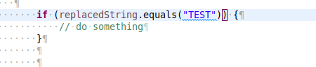
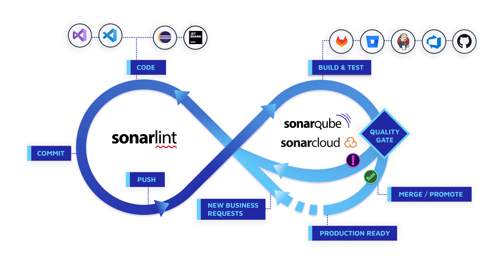
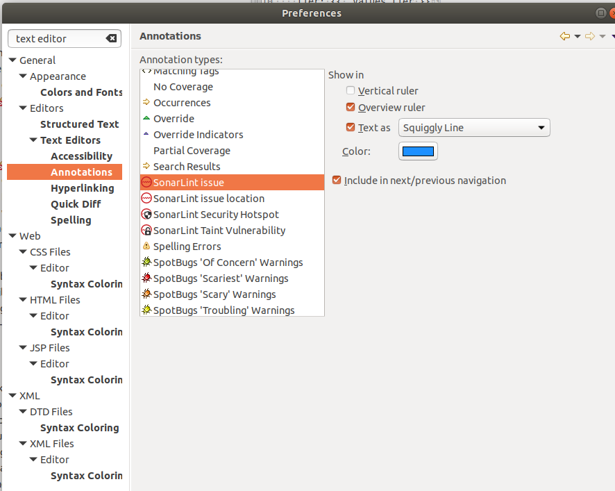
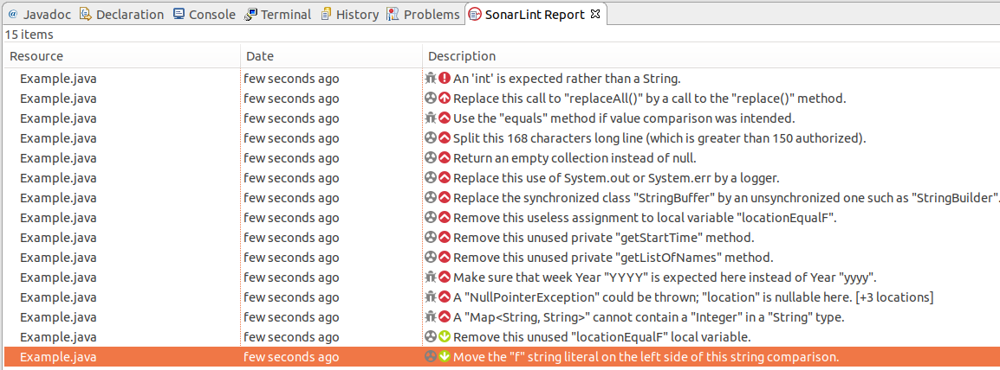

# TechTalk: SonarLint and Clean Code

 
 

[SonarLint](https://www.sonarlint.org/) is an open source IDE plugin (Eclipse, Intellij, VisualStudio)  that helps you detect and fix quality issues **as you write (real time)** in order to:

  

*   Avoid Bugs
*   Write more performant code
*   Write cleaner code

  

SonarLint is a _member_ of the well-known [SonarQube](https://www.sonarqube.org/) ecosystem. But it can work as a standalone product.

  

## Rules
 

[SonarLint](https://www.sonarlint.org/) defines a set of Rules for many languages. For Java [it covers more than 640 rules](https://rules.sonarsource.com/java)

Each rule is categorized into the following:

*   **Bug**
*   **Code Smell**
*   **Vulnerability**
*   **Security HotSpot**

  

and a Severity Level  (Impact  / Likelihood):

*   **Minor**
*   **Major**
*   **Critical**
*   **Blocker**

Please find more information about rules [here](https://docs.sonarqube.org/latest/user-guide/rules/)

  

## Installation and Configuration
 

### Installation in Eclipse
 
1.  As first step, update your lombok.jar (located in your eclipse directory) to the [latest version](https://projectlombok.org/download) 
2.  Using eclipse MarketPlace, install "SonarLint" plugin
3.  Restart your eclipse
4.  Check it is available  in Eclipse Preferences → SonarLint

  

### Configuration
 
1.  Go to Preferences → SonarLint → Rules Configuration

You can enable or disable rules for a particular language. Some of them can be configured by setting parameters. Once enable or disabled click on Apply

It is possible to configure how Eclipse will point a rule violation in the IDE, to do that configure Text Editor Annotations  in Eclipse

 
 

### Exporting  / Importing SonarLint Rules
 

  

Although there is not straight option to Export/Import rules, the following trick works:

Rules configutations are actually stored in a settings files on your eclipse directory:

  

/eclipse/configuration/.settings/org.sonarlint.eclipse.ui.prefs

  

So you can read/write file  **org.sonarlint.eclipse.ui.prefs** in order to export/import rules.

## Using SonarLint
 
It is possible to analyze a whole  project, to do that  click on Menu "SonarLint" → Analize

  
After some time of analysis, all violations will appear in the "SonarLint Repor" tab

  

 

However, as pointed before,  the most interesting option is the ability to analyze code **as we write,** it underlines  the problematic code and 

when the pointer is over the code, it shows a little popup with the

*   Name of the rule
*   Fixes available, which may include among others: 
    *   _**Open description of rule**_: a detailed explanation about the rule
    *   _**Deactivate Rule**_

  

## Rules
 

### Some interesting rules to avoid bugs:

  

<table class="wrapped relative-table confluenceTable" style="width: 71.1145%;"><colgroup><col style="width: 53.1605%;"></colgroup><colgroup><col style="width: 7.19942%;"></colgroup><colgroup><col style="width: 9.90641%;"></colgroup><colgroup><col style="width: 29.6616%;"></colgroup><tbody><tr><th class="confluenceTh">Rule</th><th colspan="1" class="confluenceTh">Category</th><th colspan="1" class="confluenceTh">Security Level</th><th colspan="1" class="confluenceTh">Comment</th></tr><tr><td colspan="1" class="confluenceTd">
<a class="external-link" href="https://rules.sonarsource.com/java/RSPEC-2259" rel="nofollow">Null pointers should not be dereferenced</a>
</td><td colspan="1" class="confluenceTd">Bug</td><td colspan="1" class="confluenceTd">Major</td><td colspan="1" class="confluenceTd">very useful to avoid NPE</td></tr><tr><td class="confluenceTd">
<a class="external-link" href="https://rules.sonarsource.com/java/type/Bug/RSPEC-3986" rel="nofollow">Week Year ("YYYY") should not be used for date formatting</a>
</td><td colspan="1" class="confluenceTd">Bug</td><td colspan="1" class="confluenceTd">Major</td><td colspan="1" class="confluenceTd">subtle bug→ only happens in one week of the year</td></tr><tr><td colspan="1" class="confluenceTd">
<a class="external-link" href="https://rules.sonarsource.com/java/RSPEC-4973" rel="nofollow">Strings and Boxed types should be compared using "equals()"</a>
</td><td colspan="1" class="confluenceTd">Bug</td><td colspan="1" class="confluenceTd">Major</td><td colspan="1" class="confluenceTd">subtle bug&nbsp;→ only detectable sometimes</td></tr><tr><td colspan="1" class="confluenceTd">
<a class="external-link" href="https://rules.sonarsource.com/java/RSPEC-2175" rel="nofollow">Inappropriate "Collection" calls should not be made</a>
</td><td colspan="1" class="confluenceTd">Bug</td><td colspan="1" class="confluenceTd">Major</td><td colspan="1" class="confluenceTd">subtle bug&nbsp;→ only detectable in runtime</td></tr><tr><td colspan="1" class="confluenceTd">
<a class="external-link" href="https://rules.sonarsource.com/java/RSPEC-2275" rel="nofollow">Printf-style format strings should not lead to unexpected behavior at runtime</a>
</td><td colspan="1" class="confluenceTd">Bug</td><td colspan="1" class="confluenceTd">Blocker</td><td colspan="1" class="confluenceTd">subtle bug&nbsp;→ only detectable in runtime</td></tr><tr><td colspan="1" class="confluenceTd"><a class="external-link" href="https://rules.sonarsource.com/java/RSPEC-1168" rel="nofollow">Empty arrays and collections should be returned instead of null</a></td><td colspan="1" class="confluenceTd">Code Smell</td><td colspan="1" class="confluenceTd">Major</td><td colspan="1" class="confluenceTd">good practice&nbsp;→ avoid potential bug NPE</td></tr><tr><td colspan="1" class="confluenceTd">
<a class="external-link" href="https://rules.sonarsource.com/java/tag/bad-practice/RSPEC-1132" rel="nofollow">Strings literals should be placed on the left side when checking for equality</a>
</td><td colspan="1" class="confluenceTd">Code Smell</td><td colspan="1" class="confluenceTd">Major</td><td colspan="1" class="confluenceTd">good practice&nbsp;→ avoid potential bug NPE</td></tr></tbody></table>

  

  

### Some interesting rules to optimize performance :

  

<table class="wrapped relative-table confluenceTable" style="width: 71.1145%;"><colgroup><col style="width: 53.1605%;"></colgroup><colgroup><col style="width: 7.19942%;"></colgroup><colgroup><col style="width: 9.90641%;"></colgroup><colgroup><col style="width: 29.6616%;"></colgroup><tbody><tr><th class="confluenceTh">Rule</th><th colspan="1" class="confluenceTh">Category</th><th colspan="1" class="confluenceTh">Security Level</th><th colspan="1" class="confluenceTh">Comment</th></tr><tr><td colspan="1" class="confluenceTd"><a class="external-link" href="https://rules.sonarsource.com/java/RSPEC-5361" rel="nofollow">"String#replace" should be preferred to "String#replaceAll"</a></td><td colspan="1" class="confluenceTd">Code Smell</td><td colspan="1" class="confluenceTd">Critical</td><td colspan="1" class="confluenceTd">performance tip</td></tr><tr><td colspan="1" class="confluenceTd"><a class="external-link" href="https://rules.sonarsource.com/java/RSPEC-1149" rel="nofollow">Synchronized classes Vector, Hashtable, Stack and StringBuffer should not be used</a></td><td colspan="1" class="confluenceTd">Code Smell</td><td colspan="1" class="confluenceTd">Major</td><td colspan="1" class="confluenceTd">performance tip</td></tr><tr><td colspan="1" class="confluenceTd"><a class="external-link" href="https://rules.sonarsource.com/java/type/Code%20Smell/RSPEC-1640" rel="nofollow">Maps with keys that are enum values should be replaced with EnumMap</a></td><td colspan="1" class="confluenceTd">Code Smell</td><td colspan="1" class="confluenceTd">Minor</td><td colspan="1" class="confluenceTd">performance tip</td></tr></tbody></table>

  

  

### Some interesting rules for good **CLEAN CODE**

  

**Please consider these rules just a guideline. There are cases in which is good idea to break the rule indeed.**

<table class="wrapped relative-table confluenceTable" style="width: 71.2168%;"><colgroup><col style="width: 52.931%;"></colgroup><colgroup><col style="width: 6.95402%;"></colgroup><colgroup><col style="width: 10.3448%;"></colgroup><colgroup><col style="width: 29.6552%;"></colgroup><tbody><tr><th class="confluenceTh">Rule</th><th colspan="1" class="confluenceTh">Category</th><th colspan="1" class="confluenceTh">Security Level</th><th colspan="1" class="confluenceTh">Comment</th></tr><tr><td colspan="1" class="confluenceTd"><a class="external-link" href="https://rules.sonarsource.com/java/RSPEC-138" rel="nofollow">Methods should not have too many lines</a></td><td colspan="1" class="confluenceTd">Code Smell</td><td colspan="1" class="confluenceTd">Major</td><td colspan="1" class="confluenceTd">

50&nbsp;

<em>This is a controversial point.</em>

<em>Clean Code Guru Robert C. Martin (Uncle Bob) says:</em>

<em>"My rule is “extract till you drop”. A function is too big if I can meaningfully extract another function from it. This often leads to functions that are 5 lines or less."</em>

NOTE: Small methods are likely to be inlined by the JIT
</td></tr><tr><td colspan="1" class="confluenceTd"><a class="external-link" href="https://rules.sonarsource.com/java/RSPEC-107" rel="nofollow">Methods should not have too many parameters</a></td><td colspan="1" class="confluenceTd">Code Smell</td><td colspan="1" class="confluenceTd">Major</td><td colspan="1" class="confluenceTd">
5&nbsp;

<em>This is a controversial point</em>

<em>"Uncle Bob says three is the maximum arguments acceptable&nbsp;!!"</em>
</td></tr><tr><td colspan="1" class="confluenceTd">
<a class="external-link" href="https://rules.sonarsource.com/java/RSPEC-1142" rel="nofollow">Methods should not have too many return statements</a>
</td><td colspan="1" class="confluenceTd">Code Smell</td><td colspan="1" class="confluenceTd">Major</td><td colspan="1" class="confluenceTd">
3&nbsp;

<em>This is a controversial point. Uncle Bob says:</em>

<em>&nbsp;"if you keep your functions small, then the occasional multiple&nbsp;return,&nbsp;break, or&nbsp;continue&nbsp;statement does no harm and can sometimes even be more expressive than the single-entry, single-exit rule."</em>
</td></tr><tr><td colspan="1" class="confluenceTd"><a class="external-link" href="https://rules.sonarsource.com/java/RSPEC-1200" rel="nofollow">Classes should not be coupled to too many other classes (Single Responsibility Principle)</a></td><td colspan="1" class="confluenceTd">Code Smell</td><td colspan="1" class="confluenceTd">Major</td><td colspan="1" class="confluenceTd">30 → goal: class should be only one responsability.&nbsp;→ split class if this rule is violated</td></tr><tr><td colspan="1" class="confluenceTd">
<a class="external-link" href="https://rules.sonarsource.com/java/RSPEC-1820" rel="nofollow">Classes should not have too many fields</a>
</td><td colspan="1" class="confluenceTd">Code Smell</td><td colspan="1" class="confluenceTd">Major</td><td colspan="1" class="confluenceTd">20 (included non public)&nbsp;→ split class if this rule is violated</td></tr><tr><td colspan="1" class="confluenceTd">
<a class="external-link" href="https://rules.sonarsource.com/java/RSPEC-1448" rel="nofollow">Classes should not have too many methods</a>
</td><td colspan="1" class="confluenceTd">Code Smell</td><td colspan="1" class="confluenceTd">Major</td><td colspan="1" class="confluenceTd">25 (included non public)→ split class if this rule is violated</td></tr><tr><td colspan="1" class="confluenceTd"><a class="external-link" href="https://rules.sonarsource.com/java/RSPEC-104" rel="nofollow">Files should not have too many lines of code</a></td><td colspan="1" class="confluenceTd">Code Smell</td><td colspan="1" class="confluenceTd">Major</td><td colspan="1" class="confluenceTd">600&nbsp;→ split class if this rule is violated</td></tr><tr><td colspan="1" class="confluenceTd">
<a class="external-link" href="https://rules.sonarsource.com/java/RSPEC-134" rel="nofollow">Control flow statements "if", "for", "while", "switch" and "try" should not be nested too deeply</a>
</td><td colspan="1" class="confluenceTd">Code Smell</td><td colspan="1" class="confluenceTd">Critical</td><td colspan="1" class="confluenceTd">3 → refactor logic&nbsp; if this rule is violated</td></tr><tr><td colspan="1" class="confluenceTd">
<a class="external-link" href="https://rules.sonarsource.com/java/RSPEC-1067" rel="nofollow">Expressions should not be too complex</a>
</td><td colspan="1" class="confluenceTd">Code Smell</td><td colspan="1" class="confluenceTd">Critical</td><td colspan="1" class="confluenceTd">3→ refactor logic&nbsp; if this rule is violated</td></tr><tr><td class="confluenceTd">
<a class="external-link" href="https://rules.sonarsource.com/java/RSPEC-3776" rel="nofollow">Cognitive Complexity of methods should not be too high</a>
</td><td colspan="1" class="confluenceTd">Code Smell</td><td colspan="1" class="confluenceTd">Critical</td><td colspan="1" class="confluenceTd">
15&nbsp;→ refactor logic&nbsp; if this rule is violated

Cyclomatic Complexity is not enough&nbsp;!!

<a class="external-link" href="https://www.sonarsource.com/docs/CognitiveComplexity.pdf" rel="nofollow">https://www.sonarsource.com/docs/CognitiveComplexity.pdf</a>
</td></tr><tr><td class="confluenceTd"><ul><li><a class="external-link" href="https://rules.sonarsource.com/java/type/Code%20Smell/RSPEC-1479" rel="nofollow">"switch" statements should not have too many "case" clauses</a></li><li>
<a class="external-link" href="https://rules.sonarsource.com/java/type/Code%20Smell/RSPEC-1301" rel="nofollow">"switch" statements should have at least 3 "case" clauses</a>
</li></ul></td><td colspan="1" class="confluenceTd">Code Smell</td><td colspan="1" class="confluenceTd">Major</td><td colspan="1" class="confluenceTd">30&nbsp;→ refactor logic&nbsp; if this rule is violated</td></tr><tr><td colspan="1" class="confluenceTd"><ul><li><a class="external-link" href="https://rules.sonarsource.com/java/RSPEC-5612" rel="nofollow">Lambdas should not have too many lines</a></li><li><a class="external-link" href="https://rules.sonarsource.com/java/RSPEC-1188" rel="nofollow">Anonymous classes should not have too many lines</a></li><li>
<a class="external-link" href="https://rules.sonarsource.com/java/RSPEC-2972" rel="nofollow">Inner classes should not have too many lines of code</a>
</li></ul></td><td colspan="1" class="confluenceTd"> </td><td colspan="1" class="confluenceTd"> </td><td colspan="1" class="confluenceTd">
15→ refactor logic&nbsp; if this rule is violated

20→ refactor logic&nbsp; if this rule is violated

20→ refactor logic&nbsp; if this rule is violated
</td></tr><tr><td colspan="1" class="confluenceTd">
<a class="external-link" href="https://rules.sonarsource.com/java/RSPEC-2301" rel="nofollow">Public methods should not contain selector arguments</a>
</td><td colspan="1" class="confluenceTd">Code Smell</td><td colspan="1" class="confluenceTd">Major</td><td colspan="1" class="confluenceTd">&nbsp;refactor logic if this rule is violated</td></tr><tr><td colspan="1" class="confluenceTd"><a class="external-link" href="https://rules.sonarsource.com/java/type/Code%20Smell/RSPEC-1141" rel="nofollow">Try-catch blocks should not be nested</a></td><td colspan="1" class="confluenceTd">Code Smell</td><td colspan="1" class="confluenceTd">Major</td><td colspan="1" class="confluenceTd">&nbsp;refactor logic if this rule is violated</td></tr></tbody></table>

  

### Some interesting rules for good style (similar to _Checkstyle Plugin (eclipse-cs)_ )

  

<table class="wrapped relative-table confluenceTable" style="width: 71.2679%;"><colgroup><col style="width: 53.0079%;"></colgroup><colgroup><col style="width: 7.00646%;"></colgroup><colgroup><col style="width: 10.3948%;"></colgroup><colgroup><col style="width: 29.4616%;"></colgroup><tbody><tr><th class="confluenceTh">Rule</th><th colspan="1" class="confluenceTh">Category</th><th colspan="1" class="confluenceTh">Security Level</th><th colspan="1" class="confluenceTh">Comment</th></tr><tr><td colspan="1" class="confluenceTd">
<a class="external-link" href="https://rules.sonarsource.com/java/RSPEC-105" rel="nofollow">Tabulation characters should not be used</a>
</td><td colspan="1" class="confluenceTd">Code Smell</td><td colspan="1" class="confluenceTd">Minor</td><td colspan="1" class="confluenceTd"> </td></tr><tr><td colspan="1" class="confluenceTd">
<a class="external-link" href="https://rules.sonarsource.com/java/RSPEC-122" rel="nofollow">Statements should be on separate lines</a>
</td><td colspan="1" class="confluenceTd">Code Smell</td><td colspan="1" class="confluenceTd">Major</td><td colspan="1" class="confluenceTd"> </td></tr><tr><td colspan="1" class="confluenceTd">
<a class="external-link" href="https://rules.sonarsource.com/java/RSPEC-103" rel="nofollow">Lines should not be too long</a>
</td><td colspan="1" class="confluenceTd">Code Smell</td><td colspan="1" class="confluenceTd">Major</td><td colspan="1" class="confluenceTd">150</td></tr><tr><td colspan="1" class="confluenceTd">
<a class="external-link" href="https://rules.sonarsource.com/java/RSPEC-1107" rel="nofollow">Close curly brace and the next "else", "catch" and "finally" keywords should be located on the same line</a>
</td><td colspan="1" class="confluenceTd">Code Smell</td><td colspan="1" class="confluenceTd">Minor</td><td colspan="1" class="confluenceTd"> </td></tr><tr><td colspan="1" class="confluenceTd">
<a class="external-link" href="https://rules.sonarsource.com/java/RSPEC-122" rel="nofollow">Statements should be on separate lines</a>
</td><td colspan="1" class="confluenceTd">Code Small</td><td colspan="1" class="confluenceTd">Major</td><td colspan="1" class="confluenceTd"> </td></tr></tbody></table>

## Disable SonarLint Rules
 
Let's take an example:

Let's suposse I don't agree with a particular rule in one place, for example:

  

 

which violates  [Local variables should not be declared and then immediately returned or thrown](https://rules.sonarsource.com/java/type/Code%20Smell/RSPEC-1488)

But I really want to have this local variable because I want to inspect the variable when debugging 

In order to disable it just in one place, just add a comment at then end of the line (//NOSONAR)

  

 

## Proposed Rules Configuration
 
The rules explained before are defined in the following file:
 
[org.sonarlint.eclipse.ui.prefs](./4605476915.prefs)
 
